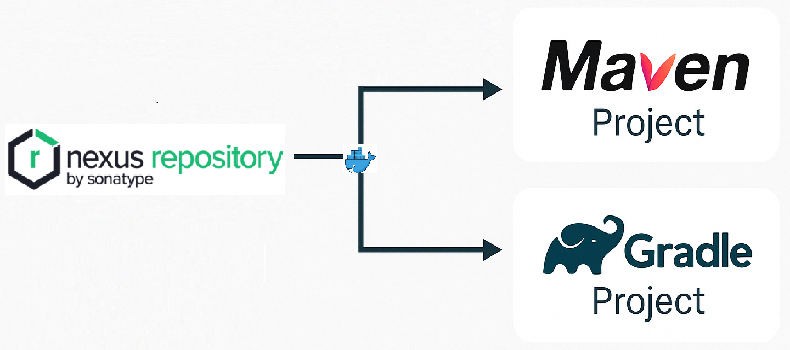

# 🐳 Private Nexus Repository with Docker Compose

This project sets up a **private Maven repository** using [Sonatype Nexus 3](https://www.sonatype.com/products/repository-oss) with **Docker Compose**. It includes a full guide to start the service, configure Nexus, and publish artifacts from Maven or Gradle.

<p align="center">
  
</p>

## 🚀 Quick Start with Docker Compose

> Requires Docker and Docker Compose installed.

### 🧾 `docker-compose.yml`
<details><summary>📄 Click to expand docker-compose.yml</summary>
<pre><code>version: '3.8'
services:
  nexus:
    image: sonatype/nexus3:latest
    container_name: nexus
    ports:
      - "8081:8081"
    volumes:
      - nexus-data:/nexus-data
    restart: unless-stopped
volumes:
  nexus-data:</code></pre>
</details>

## ▶️ Launch Nexus
```bash
docker-compose up -d --build
```
👉 Nexus will be accessible at:  http://localhost:8081

Default credentials:

-   **Username:** `admin`
    
-   **Password:** see file `/nexus-data/admin.password` inside the container or check logs:
```bash
docker exec -it nexus cat /nexus-data/admin.password
```

## 🛠️ Nexus Repository Configuration (UI)

### 1. Create Hosted Repositories
Go to **Settings → Repositories → Create repository**, and create the following:

| Repository ID      | Type               | Version Policy | Remote / Includes                              |
|--------------------|--------------------|----------------|------------------------------------------------|
| `nexus-releases`   | `maven2 (hosted)`  | `Release`      | —                                              |
| `nexus-snapshots`  | `maven2 (hosted)`  | `Snapshot`     | —                                              |
| `maven-central`    | `maven2 (proxy)`   | —              | `https://repo1.maven.org/maven2/`              |
| `maven-public`     | `maven2 (group)`   | —              | `nexus-releases`, `nexus-snapshots`, `maven-central` |

## ⚙️ Maven Configuration

To allow Maven to authenticate and resolve dependencies from your Nexus server, configure your `~/.m2/settings.xml`.

You can find a ready-to-use example here:  
📄 [`m2/settings.xml`](./m2/settings.xml)

> ☝️ This configuration defines credentials for deploying artifacts and sets up the `maven-public` group as the main source of dependencies and plugins.

## 📦 Publishing Artifacts
You can publish your libraries using **Maven**, **Gradle**, or even **cURL**. Choose the method that best fits your project workflow.

### 🔹 1. Deploy using Maven
```bash
mvn deploy:deploy-file \
  -Dfile=target/demo-1.0.0-SNAPSHOT.jar \
  -DgroupId=com.example \
  -DartifactId=demo \
  -Dversion=1.0.0-SNAPSHOT \
  -Dpackaging=jar \
  -DrepositoryId=nexus-snapshots \
  -Durl=http://localhost:8081/repository/nexus-snapshots/
```
> Use `nexus-snapshots` instead of `nexus-releases` for final versions (e.g. `1.0.0`).

### 🔹 2. Deploy using Gradle
If you're using Gradle, make sure your `build.gradle` is configured to publish artifacts to Nexus.

You can find a complete example in:  
📄 [`demo/build.gradle`](./demo/build.gradle)

> Run the publish task: 
```bash
./gradlew publish
```

### 🔹 3. Deploy using provided scripts
You can automate the upload process using the included deployment scripts in [`demo/scripts/`](./demo/scripts):
| Script                                                                 | OS           | Description                         |
|------------------------------------------------------------------------|--------------|-------------------------------------|
| [`deploy-to-nexus.sh`](./demo/scripts/deploy-to-nexus.sh)             | Linux/macOS  | Upload artifacts via `curl`         |
| [`deploy-to-nexus.bat`](./demo/scripts/deploy-to-nexus.bat)           | Windows      | Same logic for Windows CMD          |
> ✅ These scripts auto-detect whether the version is `SNAPSHOT` or `RELEASE` and upload to the appropriate Nexus repository.

**Usage:**
```bash
# Linux/macOS
bash demo/scripts/deploy-to-nexus.sh

# Windows
.\demo\scripts\deploy-to-nexus.bat
```

### 🔹 4. Deploy using `CURL` (manual upload per file)
If you already have the `.jar`, `.pom`, `-sources.jar` and `-javadoc.jar`, you can upload them with:
```bash
# Upload POM
curl -v --user admin:nexus \
  --upload-file demo/pom.xml \
  http://localhost:8081/repository/nexus-snapshots/com/example/demo/1.0.0-SNAPSHOT/demo-1.0.0-SNAPSHOT.pom

# Upload JAR
curl -v --user admin:nexus \
  --upload-file demo/build/libs/demo-1.0.0-SNAPSHOT.jar \
  http://localhost:8081/repository/nexus-snapshots/com/example/demo/1.0.0-SNAPSHOT/demo-1.0.0-SNAPSHOT.jar

# Upload sources JAR
curl -v --user admin:nexus \
  --upload-file demo/build/libs/demo-1.0.0-SNAPSHOT-sources.jar \
  http://localhost:8081/repository/nexus-snapshots/com/example/demo/1.0.0-SNAPSHOT/demo-1.0.0-SNAPSHOT-sources.jar

# Upload javadoc JAR
curl -v --user admin:nexus \
  --upload-file demo/build/libs/demo-1.0.0-SNAPSHOT-javadoc.jar \
  http://localhost:8081/repository/nexus-snapshots/com/example/demo/1.0.0-SNAPSHOT/demo-1.0.0-SNAPSHOT-javadoc.jar
```
> ✅ Scripts `deploy-to-nexus.sh` (Linux/macOS) and `deploy-to-nexus.bat` (Windows) are included for convenience.

## 📁 Project Structure
```pgsql
.
├── docker-compose.yml
├── README.md
├── demo/scripts/deploy-to-nexus.sh
├── demo/scripts/deploy-to-nexus.bat
└── demo/
    ├── build.gradle || pom.xml
    └── build/libs || target/
```

## ✅ Best Practices

-   Always use `-SNAPSHOT` suffix for snapshot versions
    
-   Use `nexus-releases` only for final versions
    
-   Prefer the `maven-public` group in your Maven/Gradle settings
    
-   Keep your Nexus credentials encrypted or out of VCS

## 📝 License
This project is licensed under the [MIT License](./LICENSE).